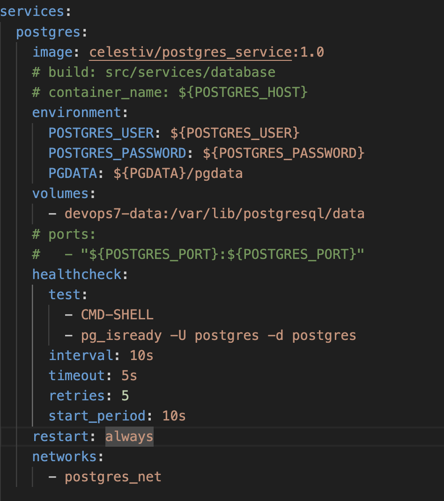
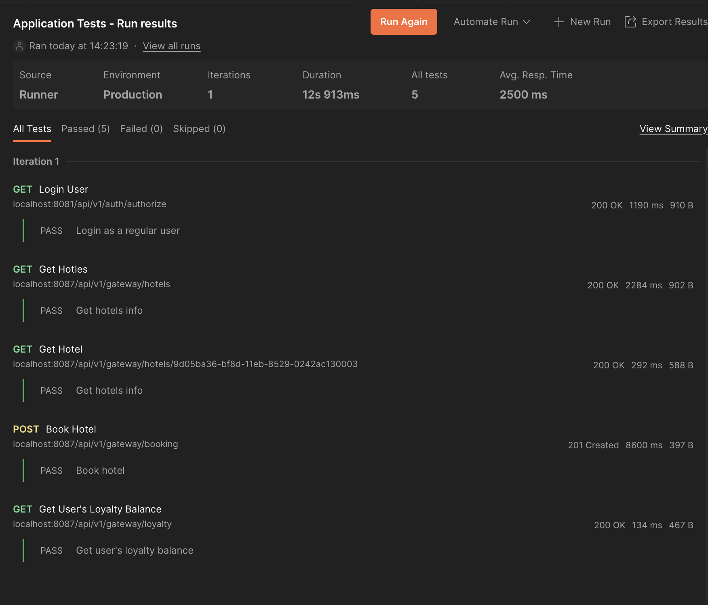
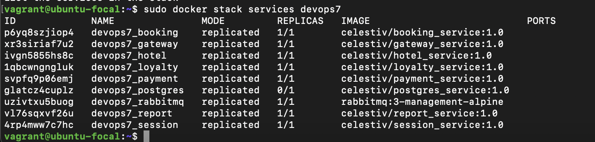
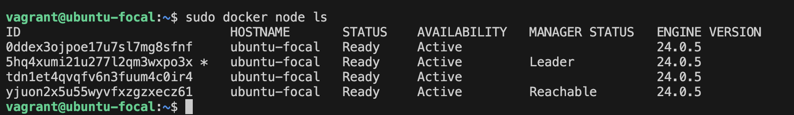
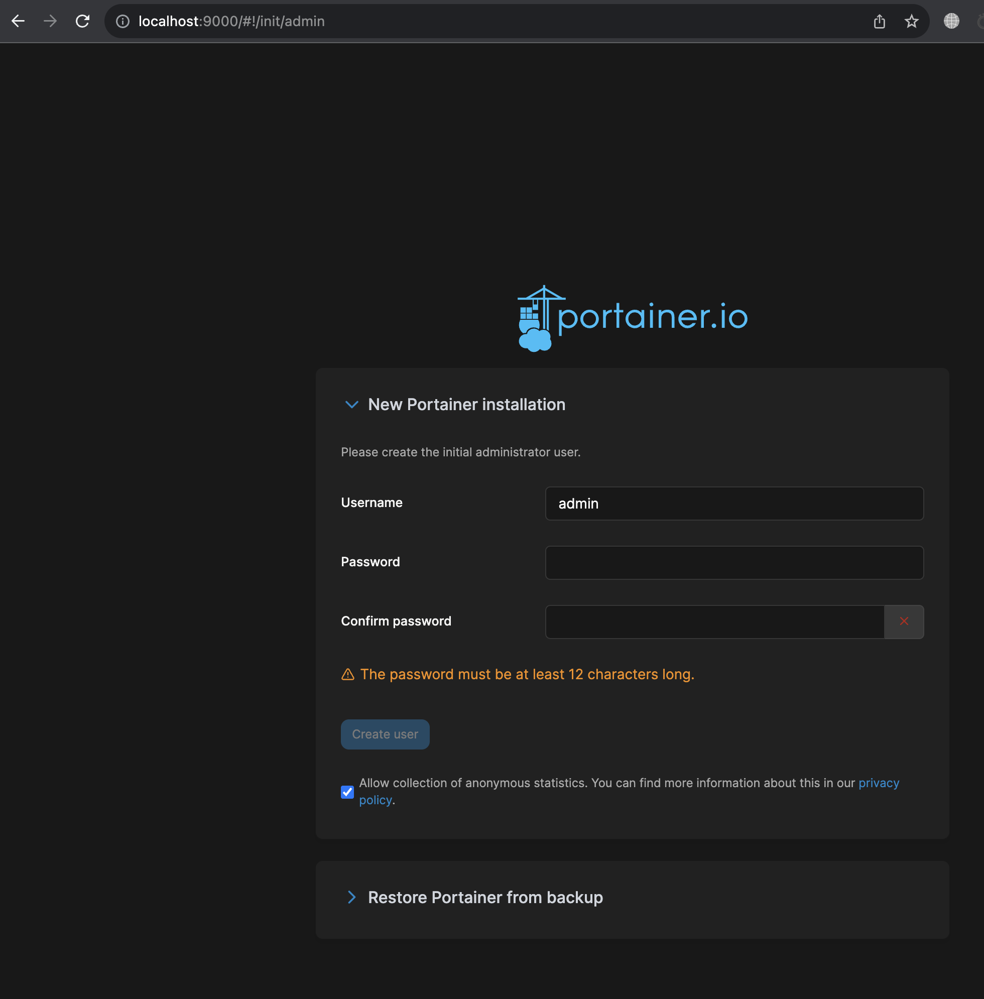
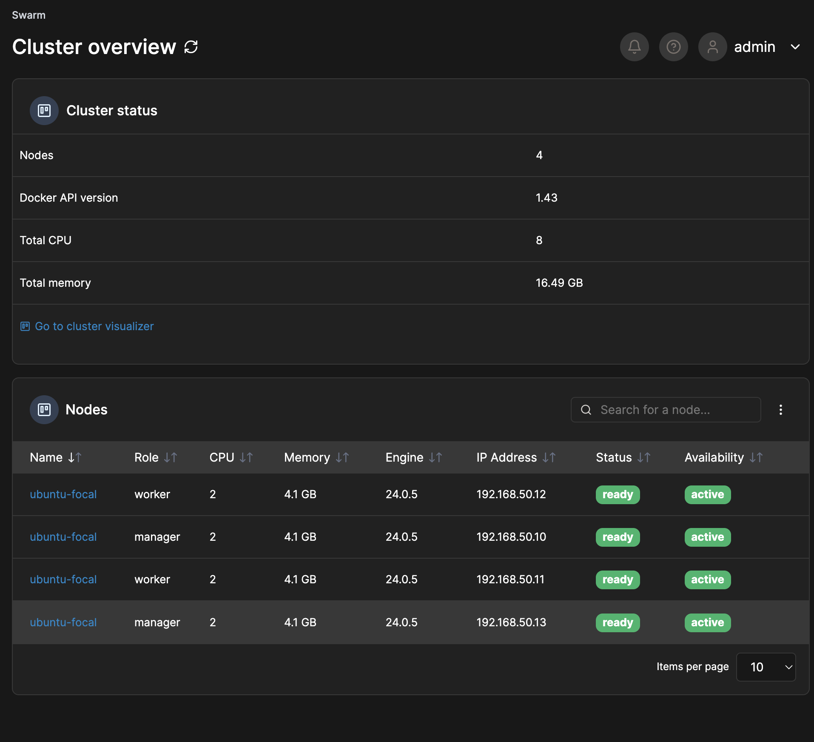

# Проект devops 7

## Part 1. Запуск нескольких docker-контейнеров с использованием docker compose

Нам предстоит собрать проект, написанный на Java, разделенный на микросервисы: booking, gateway, hotel, loyalty, payment, report, session. 

Код приложений находится в папке services. Внутри каждого микросервиса кладем Dockerfile, построенный по принципу multistage build, который включает сборку проекта и запуск готового приложения в контейнере

Настроить подключение PostgreSQL в docker помогла вот эта [статья](https://habr.com/ru/articles/578744/)

* Запускаем  docker compose командой `docker compose up --build -d`

* Размер получившихся образов можем видеть при помощи команды `docker images`

* После всех настроек можно убедиться что API успешно работает. Запускаем тесты в программе Postman

Важный момент во время выполнения задания. По ТЗ требуется открыть порты во внешний мир для сервисов gateway и session. 
Я открыл порты для всех сервисов, и это было ошибкой. Вывод:
1. Нужно внимательнее смотреть в ТЗ
2. Лишние открытые порты это угроза безопасности. Очевидный факт, но иногда нужно себе об этом напоминать

## Part 2. Vagrant

Из-за ограничений, наложенных на пользователей из России, используем кастомный источник образов для vagrant: [Репозиторий](https://vagrant.elab.pro/downloads/) из этой [статьи](https://habr.com/ru/articles/735700/)

1. Для инициализации проекта используем команду `vagrant init` в корневой директории проекта. После этого у нас появляется vagrantfile, в котором работаем дальше.

2. Добавляем простую конфигурацию, которая создает виртуальную машину на базе Ubuntu:

3. Запускаем виртуальную машину `vagrant up`

4. После запуска можно подключиться к машине командой `vagrant ssh`

5. После этого можно убедиться что в указанной директории есть файлы нашего проекта

## Part 3. Создание простейшего docker swarm

Самое интересное задание!

1. Модифицировать Vagrantfile для создания трех машин: manager01, worker01, worker02. Написать shell-скрипты для установки docker внутрь машин, инициализации и подключения к docker swarm [документация](https://developer.hashicorp.com/vagrant/docs/multi-machine)

* Модифицировать Vagrantfile для создания трех машин: manager01, worker01, worker02

    

* Создаем скрипты `setup_manager.sh` и `setup_worker.sh` для установки и настройки docker на машинах: [документация](https://docs.docker.com/engine/install/ubuntu/)

2) Загрузить собранные образы на docker hub и модифицировать docker-compose файл для подгрузки расположенных на docker hub образов.

    

    `docker deploy stack` ругается на указание портов в docker compose, и также мы заменяем сборку сервиса. 
    Вместо указания собрать образ из докерфайла в папке сервиса, мы выгружаем образ с docker hub
    Примерно так выглядят сейчас все сервисы после исправлений.

    

3) Поднять виртуальные машины и перенести на менеджер docker-compose файл. Запустить стек сервисов, используя написанный docker-compose файл.

    Просто выполняем команду `vagrant up` и не нужно ничего загружать. У меня с этим возникли проблемы, т к подключиться по ssh к машине не удалось, 
    
    а `vagrant scp` - решение, найденное в интернете, недоступно пользователям из РФ.

    Как оказалось, все файлы, находящиеся в одной папке с Vagrantfile, доступны внутри каждой из виртуальных машин в общей папке /vagrant.

    И не нужно ничего копировать внутрь. Vagrant делает это за нас. А мы просто пользуемся. Очень удобно :)

4) Настроить прокси на базе nginx для доступа к gateway service и session service по оверлейной сети. Сами gateway service и session service сделать недоступными напрямую

    Создаем файл nginx.conf, кладем его в папку `/nginx/`

    Позже, при запуске docker compose внутри виртуальной машины, этот конфиг будет использован при создании контейнера на базе образа nginx, для проксирования запросов к gateway и session сервисам.

5) Прогнать заготовленные тесты через postman и удостовериться, что все они проходят успешно. В отчете отобразить результаты тестирования.

6) Используя команды docker, отобразить в отчете распределение контейнеров по узлам.

    

    

7) Установить отдельным стеком Portainer внутри кластера. В отчете отобразить визуализацию распределения задач по узлам с помощью Portainer.

portainer это платное приложение, с возможностью активировать пробную веврсию для кластера на 3 машины. Регистрируемся и получаем лицензию, ключ активации должен прийти на почту.

[как установить portainer с docker swarm](https://academy.portainer.io/install/#/lessons/G9yRStjWn4lqViAxmDUlM4Z3km6Fmqzi)

[документация по установке portainer на Ubuntu](https://docs.portainer.io/start/install/server/swarm/linux)

После запуска четвертой виртуальной машины portainer, заходим на localhost:9000 и радуемся вот такой панели:

Сначала я попытался прописать порт 9443, но получил ошибку `Client sent an HTTP request to an HTTPS server`. Первая [ссылка](https://portal.portainer.io/knowledge/client-sent-an-http-request-to-an-https-server) в гугле помогла решить проблему

Регистрируемся с логином admin, создаем пароль более 12 символов

На следующей странице вводим токен от пробной версии portainer и получаем необходимую информацию

