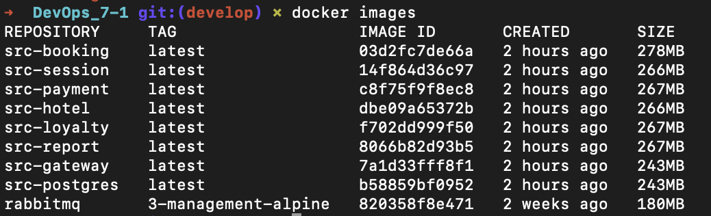
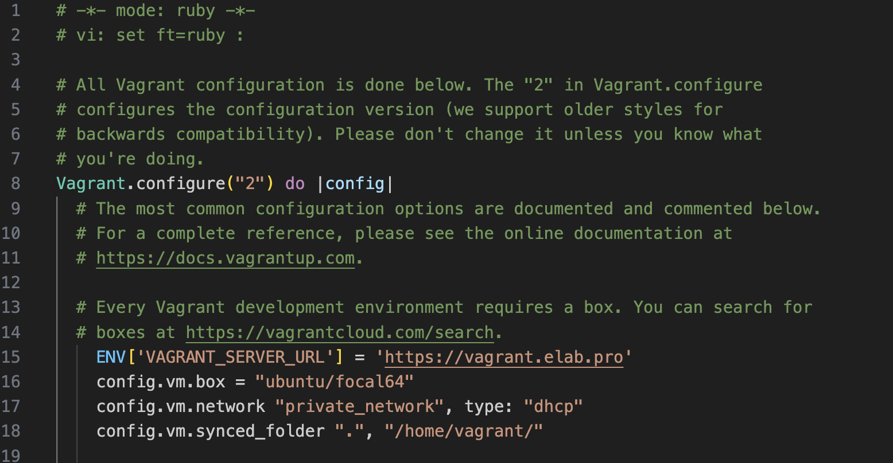
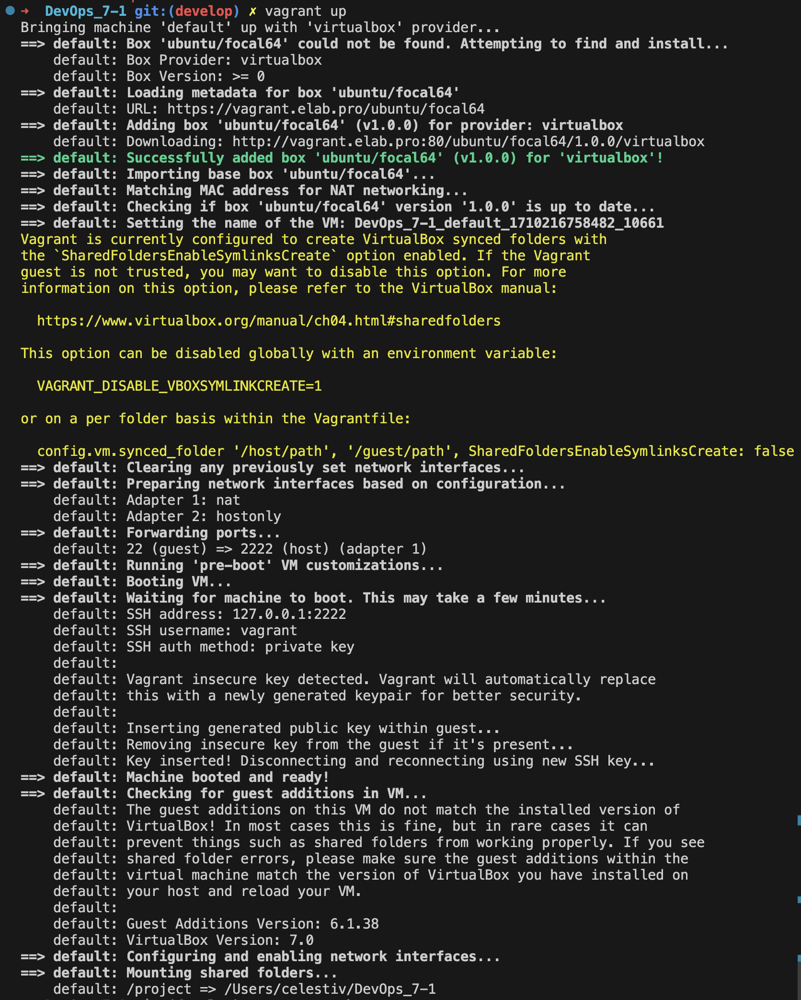
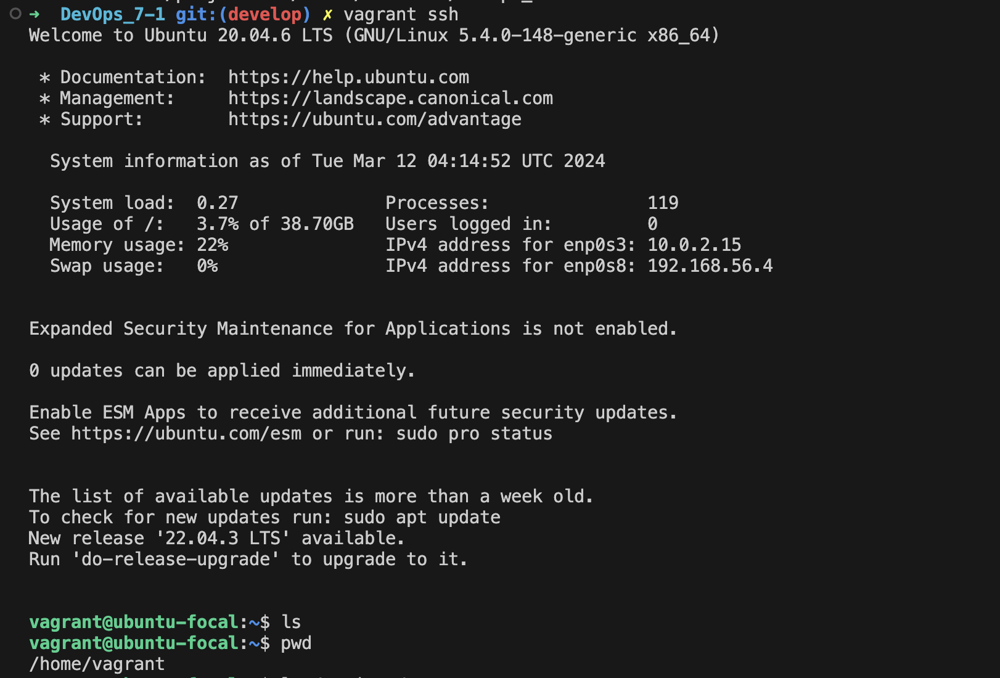
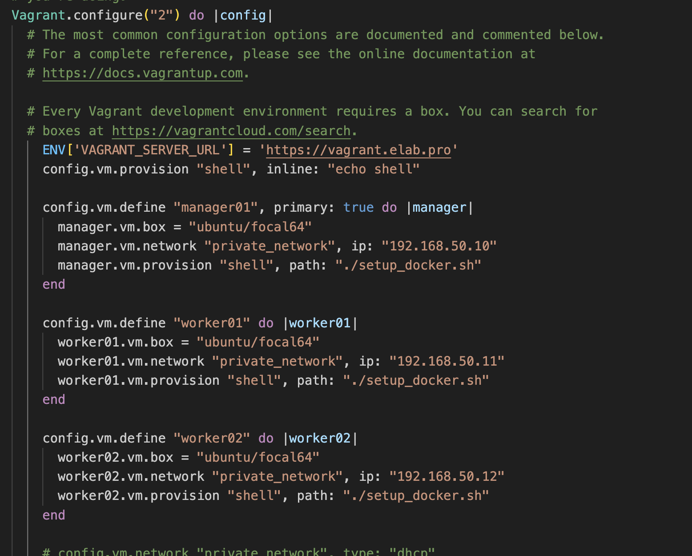
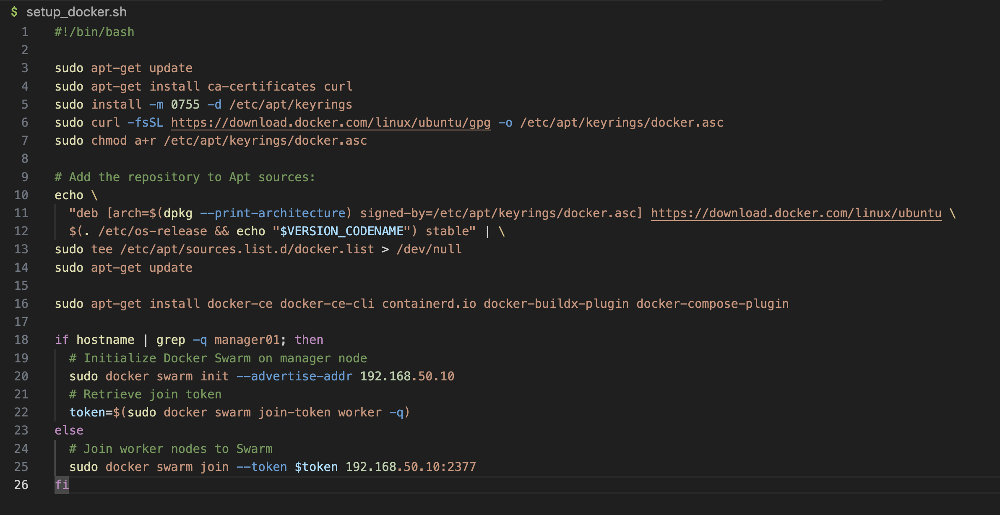

# Проект devops 7

## Part 1. Запуск нескольких docker-контейнеров с использованием docker compose

Нам предстоит собрать проект, написанный на Java, разделенный на микросервисы: booking, gateway, hotel, loyalty, payment, report, session. 

Код приложений находится в папке services. Внутри каждого микросервиса кладем Dockerfile, построенный по принципу multistage build, который включает сборку проекта и запуск готового приложения в контейнере

Настроить подключение PostgreSQL в docker помогла вот эта [статья](https://habr.com/ru/articles/578744/)

* Запускаем  docker compose командой `docker compose up --build -d`

* Размер получившихся образов можем видеть при помощи команды `docker images`

* После всех настроек можно убедиться что API успешно работает. Запускаем тесты в программе Postman

Важный момент во время выполнения задания. По ТЗ требуется открыть порты во внешний мир для сервисов gateway и session. 
Я открыл порты для всех сервисов, и это было ошибкой. Вывод:
1. Нужно внимательнее смотреть в ТЗ
2. Лишние открытые порты это угроза безопасности. Очевидный факт, но иногда нужно себе об этом напоминать

## Part 2. Vagrant

Из-за ограничений, наложенных на пользователей из России, используем кастомный источник образов для vagrant: [Репозиторий](https://vagrant.elab.pro/downloads/) из этой [статьи](https://habr.com/ru/articles/735700/)

1. Для инициализации проекта используем команду `vagrant init` в корневой директории проекта. После этого у нас появляется vagrantfile, в котором работаем дальше.

2. Добавляем простую конфигурацию, которая создает виртуальную машину на базе Ubuntu:

3. Запускаем виртуальную машину `vagrant up`

4. После запуска можно подключиться к машине командой `vagrant ssh`

5. После этого можно убедиться что в указанной директории есть файлы нашего проекта

## Part 3. Создание простейшего docker swarm

Самое интересное задание!

1. Модифицируем vagrantfile так, чтобы создавалось сразу 3 машины по [документации](https://developer.hashicorp.com/vagrant/docs/multi-machine)

2. Создаем скрипт для установки и настройки docker на машинах: [документация](https://docs.docker.com/engine/install/ubuntu/)

3. 