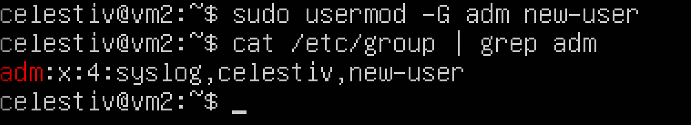
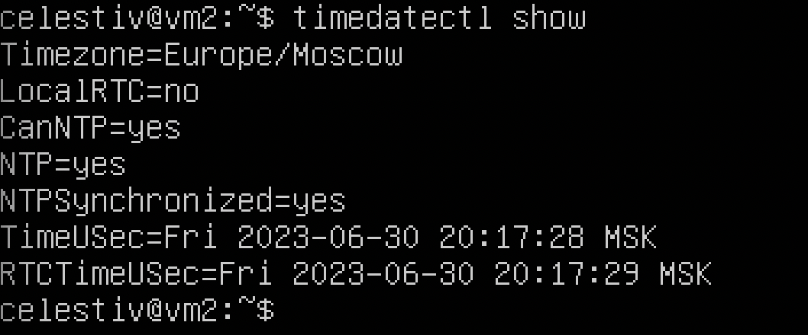
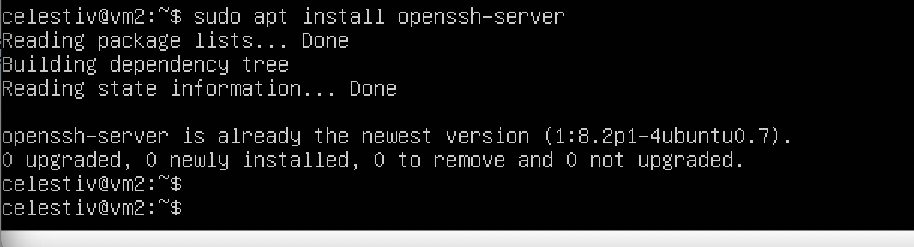
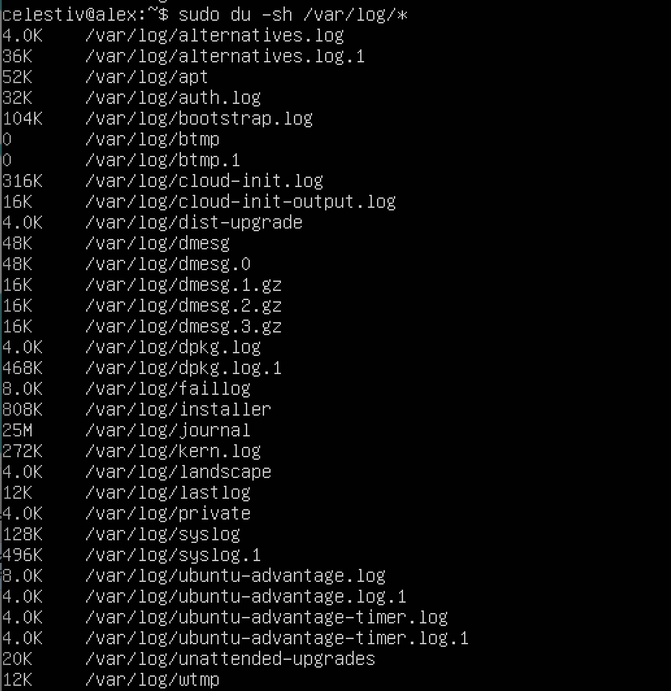
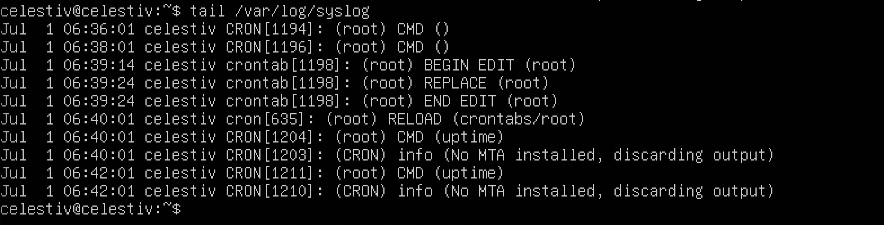

# Report DevOps1 Linux
 
Проект номер 1 на ветке DevOps в Школе 21. Основы операционной системы Linux, простые команды и администрирование.

## Part 1. Installation of the OS

##### Установить **Ubuntu 20.04 Server LTS** без графического интерфейса. (Используем программу для виртуализации - VirtualBox)

- Графический интерфейс должен отсутствовать.

- Узнайте версию Ubuntu, выполнив команду \
`cat /etc/issue.`

<details>
  <summary>new linux installation screenshot</summary>


</details>

___

## Part 2: Creating a user

##### Создать пользователя, отличного от пользователя, который создавался при установке. Пользователь должен быть добавлен в группу `adm`.

- Вставьте скриншот вызова команды для создания пользователя.
- Новый пользователь должен быть в выводе команды \
`cat /etc/passwd`

<details>
  <summary>new-user screenshot</summary>




</details>

___

## Part 3. Setting up the OS network

**== Задание ==**

##### Задать название машины вида user-1  
##### Установить временную зону, соответствующую вашему текущему местоположению.  
##### Вывести названия сетевых интерфейсов с помощью консольной команды.
- В отчёте дать объяснение наличию интерфейса lo.  
##### Используя консольную команду получить ip адрес устройства, на котором вы работаете, от DHCP сервера. 
- В отчёте дать расшифровку DHCP.  
##### Определить и вывести на экран внешний ip-адрес шлюза (ip) и внутренний IP-адрес шлюза, он же ip-адрес по умолчанию (gw). 
##### Задать статичные (заданные вручную, а не полученные от DHCP сервера) настройки ip, gw, dns (использовать публичный DNS серверы, например 1.1.1.1 или 8.8.8.8).  
##### Перезагрузить виртуальную машину. Убедиться, что статичные сетевые настройки (ip, gw, dns) соответствуют заданным в предыдущем пункте.  

- В отчёте опишите, что сделали для выполнения всех семи пунктов (можно как текстом, так и скриншотами).
- Успешно пропинговать удаленные хосты 1.1.1.1 и ya.ru и вставить в отчёт скрин с выводом команды. В выводе команды должна быть фраза "0% packet loss".

<details>
    <summary>network setup</summary>

### part 3.1 change hostname


### part 3.2 change timezone


### part 3.3.1 install net-tools. Уже установлено


### part 3.3.2 ```ip -br link show``` show interfaces

> lo (loopback device) – виртуальный интерфейс, присутствующий по умолчанию в любом Linux.
> Он используется для отладки сетевых программ и запуска серверных приложений на локальной машине.
> С этим интерфейсом всегда связан адрес 127.0.0.1. У него есть dns-имя – localhost. 
> Посмотреть привязку можно в файле /etc/hosts.


### part 3.3.3 ```ip route``` shows current ip settings

> DHCP (Dynamic Host Configuration Protocol) is a network management protocol
> used to dynamically assign an IP address to any device, or node, on a network so it can communicate using IP.


### part 3.3.4 ```sudo nano /etc/netplan/00-installer-config.yaml```


### part 3.3.4 ```ip route``` again to show that now we changed ip address to static


### part 3.3.6 ```ping -c 5 ya.ru``` try to connect to ```ya.ru``` 5 times and show 0% packet loss


### part 3.3.7 ```ping -c 5 1.1.1.1``` try to connect to DNS server 1.1.1.1


</details>

___

## Part 4. OS Update

**== Задание ==**

##### Обновить системные пакеты до последней на момент выполнения задания версии.  

- После обновления системных пакетов, если ввести команду обновления повторно, должно появится сообщение, что обновления отсутствуют.

<details>
    <summary>upgrade screenshot</summary>


</details>

___

## Part 5. Using the sudo utility

**== Задание ==**

##### Разрешить пользователю, созданному в [Part 2](#part-2-создание-пользователя), выполнять команду sudo.

- В отчёте объяснить *истинное* назначение команды sudo (про то, что это слово - "волшебное", писать не стоит).  
- Поменять hostname ОС от имени пользователя, созданного в пункте [Part 2](#part-2-создание-пользователя) (используя sudo).

<details>
    <summary>sudo screenshot</summary>

**SUDO** расшифровывается как **Switch User DO**. Так мы объявляем, что запускать программу нужно от имени администратора, который имеет более обширные права в системе


</details>

___

## Part 6. Installing and configuring the time service

**== Задание ==**

##### Настроить службу автоматической синхронизации времени.  

- Вывести время, часового пояса, в котором вы сейчас находитесь.
- Вывод следующей команды должен содержать `NTPSynchronized=yes`: \
  `timedatectl show`

<details>
    <summary>timedatectl screenshot</summary>



</details>

___

## Part 7. Installing and using text editors

**== Задание ==**

##### Установить текстовые редакторы **VIM** (+ любые два по желанию **NANO**, **MCEDIT**, **JOE** и т.д.)  
##### Используя каждый из трех выбранных редакторов, создайте файл *test_X.txt*, где X -- название редактора, в котором создан файл. Напишите в нём свой никнейм, закройте файл с сохранением изменений.  
- В отчёт вставьте скриншоты:
  - Из каждого редактора с содержимым файла перед закрытием.
- В отчёте укажите, что сделали для выхода с сохранением изменений.
##### Используя каждый из трех выбранных редакторов, откройте файл на редактирование, отредактируйте файл, заменив никнейм на строку "21 School 21", закройте файл без сохранения изменений.
- В отчёт вставьте скриншоты:
    - Из каждого редактора с содержимым файла после редактирования.
- В отчёте укажите, что сделали для выхода без сохранения изменений.
##### Используя каждый из трех выбранных редакторов, отредактируйте файл ещё раз (по аналогии с предыдущим пунктом), а затем освойте функции поиска по содержимому файла (слово) и замены слова на любое другое.

### **7.1. VIM**

<details>
    <summary>VIM screenshots</summary>

#### vim уже установлен


#### Создаем файл и записываем в него свой никнейм

```vim test_vim.txt```, затем нажимаем **i**, чтобы войти в режим редактирования и набираем текст

Нажимаем ```Esc```, затем пишем ```:wq``` чтобы выйти и сохранить изменения


#### снова открываем текстовый файл, вносим изменения и выходим без сохранения: ```:q!```


#### поиск и замена совпадений в VIM

1. открываем файл ```vim test_vim.txt```

2. пишем **/** (слэш) и после него искомое слово

3. Нажимаем Enter, чтобы перейти к этому слову в тексте

4. Набираем три буквы ```cgn```

5. Редактируем текст один раз

6. Нажимаем Escape

7. Переходим к следующему совпадению и заменяем его нажатием двух кнопок: ```N``` и ```.```

8. Повторяем последнюю комбинацию из пункта 7 нужное количество раз


</details>

### **7.2. NANO**

<details>
    <summary>NANO screenshots</summary>

#### nano уже установлен


#### Создаем файл и записываем в него свой никнейм

```nano test_nano.txt```, затем набираем текст. Для выхода с сохранением жмём ```Ctrl-X```, ```y```, ```Enter```


#### выходим без сохранения

```nano test_nano.txt```. Для выхода жмём ```Ctrl-X```, выбираем опцию ```NO```


#### поиск и замена совпадений в NANO

1. открываем файл ```nano test_nano.txt```

2. ```Ctrl-W``` для включения режима поиска

3. ```Ctrl-R``` входим в режим Replace. Так сможем массово заменить все совпадения

4. Набираем текст для поиска, затем жмем ```Enter```

5. Набираем текст для замены, затем жмем ```Enter```

6. Здесь либо жмем кнопку ```A```, после чего все найденные вхождения будет заменены на новый текст.

Либо выбираем ```Y``` или ```N``` для пошаговой замены найденных слов


</details>

### **7.3. JOE**

<details>
    <summary>JOE screenshots</summary>

#### joe уже установлен


#### Создаем файл и записываем в него свой никнейм

```joe test_joe.txt```. Чтобы сохранить изменения, нажимаем ```Ctrl-K```, ```X```


#### Вносим изменения без сохранения

Нажимаем ```Ctrl-C```


#### Массовый поиск и изменение

1. Нажимаем ```Ctrl-K```, ```F```

2. Вводим искомый текст

3. Нажимаем ```R```, чтобы войти в режим массового редактирования

4. Вводим текст для замены

5. Выбираем ```Y``` или ```N``` для пошаговой замены найденных слов, или сразу заменяем все нажатием ```R```


</details>

___

## Part 8. Installing and basic setup of the SSHD service

**== Задание ==**

##### Установить службу SSHd.  
##### Добавить автостарт службы при загрузке системы.  
##### Перенастроить службу SSHd на порт 2022.  
##### Используя команду ps, показать наличие процесса sshd. Для этого к команде нужно подобрать ключи.
- В отчёте объяснить значение команды и каждого ключа в ней.
##### Перезагрузить систему.
- В отчёте опишите, что сделали для выполнения всех пяти пунктов (можно как текстом, так и скриншотами).
- Вывод команды netstat -tan должен содержать  \
`tcp 0 0 0.0.0.0:2022 0.0.0.0:* LISTEN`  \
(если команды netstat нет, то ее нужно установить)

<details>
    <summary>ssh screenshots</summary>

### Part 8.1. SSH already installed




### Part 8.2. changed default port to 2022


### Part 8.3. enable autostart of ssh service


### Part 8.4. Отображаем процесс ssh

Команда <ps -е> показывает список процессов, запущенных в сиситеме. Список довольно длинный, поэтому для поиска нужного нам процесса с именем **sshd** мы используем уже знакомую команду grep, При вызове grep через пайп (символ "|") передаем то, что вывела предыдущая команда:


### Part 8.5. Проверяем правильность настройки ssh

Netstat" – это такой инструмент, который помогает нам видеть, что происходит в сети

**"-t"** говорит ему показать только TCP-соединения

**"-a"** – чтобы он показал все соединения, даже те, которые находятся в состоянии прослушивания (listening)

**"n"** – это параметр, который говорит что нужно показать IP-адреса вместо имен


Когда мы вводим "netstat -tan", компьютер показывает список всех TCP-соединений, которые установлены в данный момент. Он показывает исходящие и входящие соединения, а также информацию о локальных и удаленных IP-адресах и портах, которые используются.
Это нужно чтобы узнать, какие соединения активны. Ты можешь увидеть, кто с тобой общается и на каких портах происходит обмен данными. Это может помочь в обнаружении проблем с сетью или отслеживании сетевой активности

**Proto** - Это тип протокола

**Recv-Q** - Это сколько байтов программе пользователя ещё не перекинули из этого сокета

**Send-Q** - А тут, наоборот, это сколько байтов ещё не подтвердили удалённому узлу. Они, так сказать, в процессе

**Local Address** - Это адрес и номер порта нашего компа где этот сокет находится

**Foreign Address** - Это адрес и номер порта, куда наш сокет подключен, какой удалённый конец

**State** - Это состояние сокета, то есть его текущее положение

**LISTEN** – Это когда сокет ждет новых подключений, просто слушает

**0.0.0.0** – А вот это вообще-то адрес по умолчанию, такой заполнительный адрес IPv4


</details>

___

## Part 9 Installing and using the top, htop utilities

##### Установить и запустить утилиты top и htop.  

- По выводу команды top определить и написать в отчёте:
  - uptime
  - количество авторизованных пользователей
  - общую загрузку системы
  - общее количество процессов
  - загрузку cpu
  - загрузку памяти
  - pid процесса занимающего больше всего памяти
  - pid процесса, занимающего больше всего процессорного времени
- В отчёт вставить скрин с выводом команды htop:
  - отсортированному по PID, PERCENT_CPU, PERCENT_MEM, TIME
  - отфильтрованному для процесса sshd
  - с процессом syslog, найденным, используя поиск 
  - с добавленным выводом hostname, clock и uptime  

### 9.1 TOP and HTOP basic search

* uptime **1 минута**
* number of authorised users **1**
* total system load **0.17 0.07 0.02**
* total number of processes **103**
* cpu load **0.0**
* memory load **145.9 Мб**
* pid of the process with the highest memory usage **540**
* pid of the process taking the most CPU time - **540**

<details>
    <summary>top and htop сортировка</summary>


```htop --sort-key PID```


```htop --sort-key PERCENT_CPU```


```htop --sort-key PERCENT_MEM```


```htop --sort-key TIME```


</details>

### 9.2. Фильтрация результатов вывода htop по имени процесса

<details>
    <summary>htop фильтрация и настройка</summary>

 Для поиска процесса в выдаче команды htop можно использовать клавиши F3 или ```/``` для поиска, F4 или ```\``` для

 фильтрации выдачи. Второй вариант удобнее, так как он позволяет оставить на экране только нужные строки. Фильтруем поиск по

 названию процесса **sshd**:


Используем поиск по слову **syslog**. Как видим, экран выглядит по другому, нужная строка подсвечена, но все остальное осталось на экране:


А теперь задача поинтереснее. Настраиваем верхнее меню на экране. Для этого нажимаем ```Shift-S``` или ```F2```. Далее

стрелками переключаемся между пунктами меню и подключаем в **Right column** нужные по заданию ```Hostname```, ```Clock```,

```Uptime```. **Clock** будет отображаться как **Time**


</details>

___

## Part 10. Using the fdisk utility


**== Задание ==**

##### Запустить команду fdisk -l.

- В отчёте написать название жесткого диска, его размер и количество секторов, а также размер swap.

<details>
    <summary>fdisk utility screenshot</summary>


* name of the hard disk - **/dev/sda**
* capacity - **10 GiB**
* number of sectors - **20971520**
* swap size **1.8G**


</details>

___

## Part 11. Using the df utility


**== Задание ==**

##### Запустить команду df.  
- В отчёте написать для корневого раздела (/):
  - размер раздела
  - размер занятого пространства
  - размер свободного пространства
  - процент использования
- Определить и написать в отчёт единицу измерения в выводе.  

<details>
    <summary>df utility screenshot</summary>

### In the report write for the root partition (/):

* partition size - **8408452**

* space used - **4195984**

* space free - **3763752**

* percentage used - **53**

* measurement unit - **byte**


### Running ```df -Th```

* partition size - **8.1G**

* space used - **4.1G**

* space free - **3.6G**

* percentage used - **53**


</details>

___

## Part 12. Using the du utility

**== Задание ==**

##### Запустить команду du.
##### Вывести размер папок /home, /var, /var/log (в байтах, в человекочитаемом виде)
##### Вывести размер всего содержимого в /var/log (не общее, а каждого вложенного элемента, используя *)

<details>
    <summary>du utility screenshot</summary>

### Output the size of the /home, /var, /var/log folders (in bytes, in human readable format)


### Output the size of all contents in /var/log (not the total, but each nested element using *)



</details>

___

## Part 13. Installing and using the ncdu utility

**== Задание ==**

##### Установить утилиту ncdu.
##### Вывести размер папок /home, /var, /var/log.

<details>
    <summary>ncdu utility screenshot</summary>

### install ncdu


### Output the size of the /home

```ncdu -e /home```


### Output the size of the /var

```ncdu -e /var```


### Output the size of the /var/log folders

```ncdu -e /var/log```


</details>

___

## Part 14. Working with system logs

**== Задание ==**

##### Открыть для просмотра:
##### 1. /var/log/dmesg
##### 2. /var/log/syslog
##### 3. /var/log/auth.log  

- Написать в отчёте время последней успешной авторизации, имя пользователя и метод входа в систему.
- Перезапустить службу SSHd.

<details>
    <summary>working with system logs screenshot</summary>

```vim /var/log/auth.log```


```sudo systemctl restart sshd```

```tail /var/log/syslog```


</details>

___

## Part 15. Using the CRON job scheduler

**== Задание ==**

##### Используя планировщик заданий, запустите команду uptime через каждые 2 минуты.
- Найти в системных журналах строчки (минимум две в заданном временном диапазоне) о выполнении.
- Вывести на экран список текущих заданий для CRON.

##### Удалите все задания из планировщика заданий.

<details>
    <summary>cron usage screenshot</summary>

### Using the job scheduler, run the uptime command in every 2 minutes.

```sudo crontab -e```


### Find lines in the system logs (at least two within a given time range) about the execution

```tail /var/log/syslog```



### Remove all tasks from the job scheduler

```sudo crontab -r```


</details>

