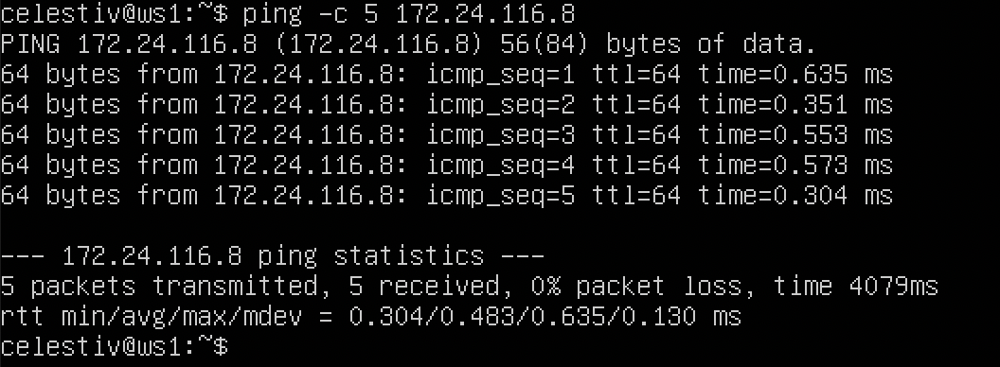
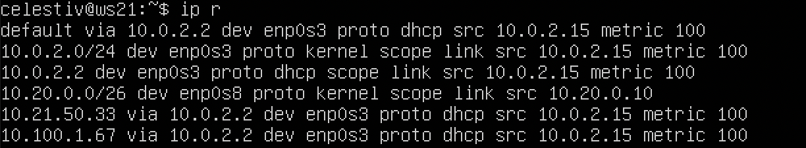
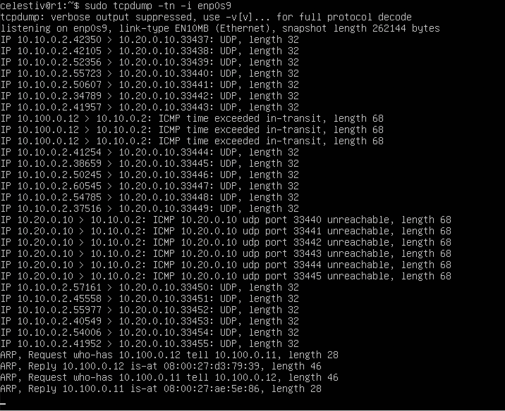
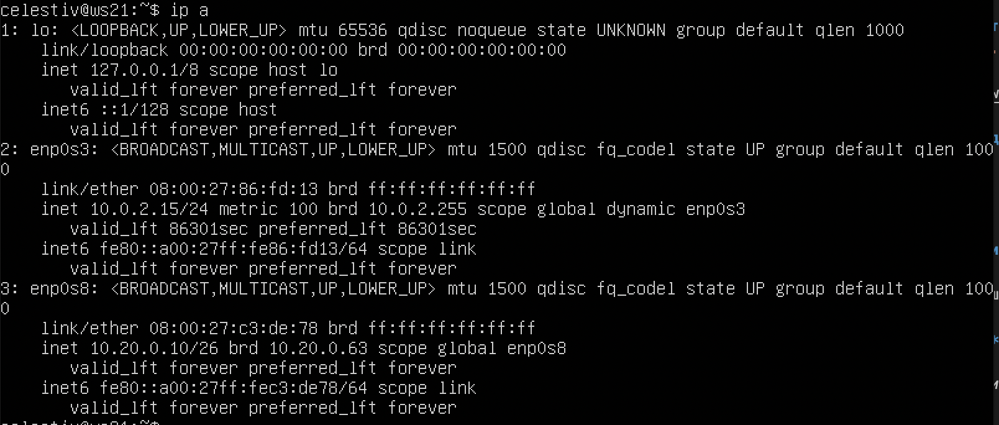
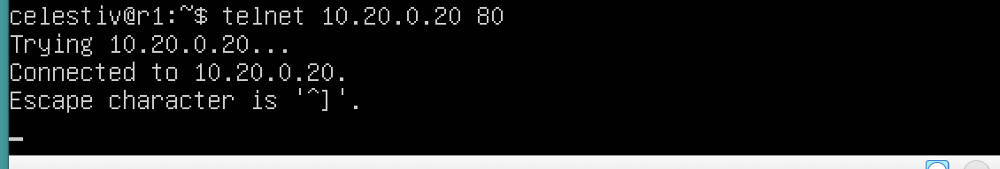

# Linux Network

## Part 1. Инструмент **ipcalc**

`-` Итак, начнём наше погружение в удивительный мир сетей со знакомства с IP адресами. А использовать для этого мы будем инструмент **ipcalc**.

**== Задание ==**

##### Поднять виртуальную машину (далее -- ws1)

#### 1.1. Сети и маски
##### Определить и записать в отчёт:
##### 1) адрес сети *192.167.38.54/13*

Видим адрес сети (Network): 192.160.0.0


##### 2) перевод маски *255.255.255.0* в префиксную и двоичную запись

Префикс - /24

Двоичная запись: 11111111 11111111 11111111 00000000


*/15* в обычную и двоичную

В обычной записи: 255.254.0.0

В двоичной записи: 11111111 1111111 0 00000000 00000000


*11111111.11111111.11111111.11110000* в обычную и префиксную

В обычной записи: 255.255.255.240

В префиксной записи: /28


##### 3) минимальный и максимальный хост в сети *12.167.38.4* при масках: */8*
Минимальный хост: 12.0.0.1

Максимальный хост: 12.255.255.254


При маске **11111111.11111111.00000000.00000000**

Минимальный хост: 12.167.0.1

Максимальный хост: 12.167.255.254


При маске *255.255.254.0*

Минимальный хост: 12.167.38.1

Максимальный хост: 12.167.39.254


При маске */4*

Минимальный хост: 0.0.0.1

Максимальный хост: 15.255.255.254


#### 1.2. localhost
##### Определить и записать в отчёт, можно ли обратиться к приложению, работающему на localhost, со следующими IP:

Смотрим нижнюю строку в выводе команды ipcalc с этими адресами и ищем слово ```Loopback```

*194.34.23.100* нельзя


*127.0.0.2* можно


*127.1.0.1* можно


*128.0.0.1* нельзя


#### 1.3. Диапазоны и сегменты сетей

##### Определить и записать в отчёт:
##### 1) какие из перечисленных IP можно использовать в качестве публичного, а какие только в качестве частных:

Чтобы ответить на этот вопрос, снова проверяем каждый адрес при помощи команды ```ipcalc```. Если в выводе в нижней строке с подписью Hosts/Net присутствует обозначение ```Private Internet```, значит адрес можно использовать только в качестве частного. Если подписи нет - можно использовать адрес в качестве публичного

*10.0.0.45* - Частный


*134.43.0.2* - Публичный


*192.168.4.2* - Частный


*172.20.250.4* - Частный


*172.0.2.1* - Публичный


*192.172.0.1* - Публичный


*172.68.0.2* - Публичный


*172.16.255.255* - Частный


*10.10.10.10* - Частный


*192.169.168.1* - Публичный


##### 2) какие из перечисленных IP адресов шлюза возможны у сети *10.10.0.0/18*:

Выбираем из списка только те адреса, которые находятся между HostMin и HostMax в результате запроса ```ipcalc 10.10.0.0/18```

*10.0.0.1* не может быть адресом шлюза

*10.10.0.2* может быть адресом шлюза

*10.10.10.10* может быть адресом шлюза

*10.10.100.1* не может быть адресом шлюза

*10.10.1.255* может быть адресом шлюза


## Part 2. Статическая маршрутизация между двумя машинами

`-` Теперь разберёмся, как связать две машины, используя статическую маршрутизацию.

**== Задание ==**

##### Поднять две виртуальные машины (далее -- ws1 и ws2)

##### С помощью команды `ip a` посмотреть существующие сетевые интерфейсы

Вывод команды на первой машине:


На второй машине:


##### Описать сетевой интерфейс, соответствующий внутренней сети, на обеих машинах и задать следующие адреса и маски:

ws1 - *192.168.100.10*, маска */16*


ws2 - *172.24.116.8*, маска */12*


##### Выполнить команду `netplan apply` для перезапуска сервиса сети


#### 2.1. Добавление статического маршрута вручную
##### Добавить статический маршрут от одной машины до другой и обратно при помощи команды вида `ip r add`
##### Пропинговать соединение между машинами


#### 2.2. Добавление статического маршрута с сохранением
##### Перезапустить машины
##### Добавить статический маршрут от одной машины до другой с помощью файла *etc/netplan/00-installer-config.yaml*


##### Пропинговать соединение между машинами


## Part 3. Утилита **iperf3**

**== Задание ==**

*В данном задании используются виртуальные машины ws1 и ws2 из Части 2*

#### 3.1. Скорость соединения

8 Mbps = 1 MB/s

100 MB/s = 800000 Kbps

1 Gbps 1000 Mbps


#### 3.2. Утилита **iperf3**
##### Измерить скорость соединения между ws1 и ws2

Флаг ```-s``` означает запустить режим сервера
```-f``` - формат вывода полученной скорости
```K``` - Килобайты в секунду


## Part 4. Сетевой экран

`-` После соединения машин, перед нами стоит следующая задача:
контролировать информацию, проходящую по соединению. Для этого
используются сетевые экраны.

**== Задание ==**

*В данном задании используются виртуальные машины ws1 и ws2 из Части 2*

#### 4.1. Утилита **iptables**
##### Создать файл */etc/firewall.sh*, имитирующий фаерволл, на ws1 и ws2:
```shell
#!/bin/sh

# Удаление всех правил в таблице "filter" (по-умолчанию).
iptables –F
iptables -X
```
##### Нужно добавить в файл подряд следующие правила:
##### 1) на ws1 применить стратегию когда в начале пишется запрещающее правило, а в конце пишется разрешающее правило (это касается пунктов 4 и 5)
##### 2) на ws2 применить стратегию когда в начале пишется разрешающее правило, а в конце пишется запрещающее правило (это касается пунктов 4 и 5)
##### 3) открыть на машинах доступ для порта 22 (ssh) и порта 80 (http)
##### 4) запретить *echo reply* (машина не должна "пинговаться”, т.е. должна быть блокировка на OUTPUT)
##### 5) разрешить *echo reply* (машина должна "пинговаться")


##### Запустить файлы на обеих машинах командами `chmod +x /etc/firewall.sh` и `/etc/firewall.sh`


Что получается в итоге:

С первой машины мы можем пингануть вторую, а вот со второй первая не пингуется. Дело в том, что правила из файла firewall.sh применяются в таком порядке, что первое написанное имеет больший приоритет перед написанными позднее. В данном случае разрешающее правило для echo-reply на второй машине сработало, а на первой - нет

#### 4.2. Утилита **nmap**
##### Командой **ping** найти машину, которая не "пингуется", после чего утилитой **nmap** показать, что хост машины запущен




Проверяем, запущена ли первая машина с помощью утилит nmap:


В отчете видно сообщение ```Host is up```. Значит мы добились желаемого результата: машина ws1 запущена, firewall работает как и ожидалось

## Part 5. Статическая маршрутизация сети

`-` Пока что мы соединяли всего две машины, но теперь пришло время для статической маршрутизации целой сети.

**== Задание ==**

##### Поднять пять виртуальных машин (3 рабочие станции (ws11, ws21, ws22) и 2 роутера (r1, r2))

Изображение для примера:


Подняты 5 машин:


#### 5.1. Настройка адресов машин
##### Настроить конфигурации машин в *etc/netplan/00-installer-config.yaml* согласно сети на рисунке.


##### Перезапустить сервис сети. Если ошибок нет, то командой `ip -4 a` проверить, что адрес машины задан верно


##### Также пропинговать ws22 с ws21. Аналогично пропинговать r1 с ws11.


#### 5.2. Включение переадресации IP-адресов.
##### Для включения переадресации IP, выполните команду на роутерах:
`sysctl -w net.ipv4.ip_forward=1`
*При таком подходе переадресация не будет работать после перезагрузки системы.*


##### Откройте файл */etc/sysctl.conf* и добавьте в него следующую строку:
`net.ipv4.ip_forward = 1`
*При использовании этого подхода, IP-переадресация включена на постоянной основе.*

*В задании написано, что строчку нужно дописать, но если внимательно посмотреть содержание файла - то можно увидеть, что она уже есть. Просто раскомментируем*


#### 5.3. Установка маршрута по-умолчанию
Пример вывода команды `ip r` после добавления шлюза:
```
default via 10.10.0.1 dev eth0
10.10.0.0/18 dev eth0 proto kernel scope link src 10.10.0.2
```

Вот так выглядит вывод команды ```ip r``` до настроек:





##### Настроить маршрут по-умолчанию (шлюз) для рабочих станций. Для этого добавить `default` перед IP роутера в файле конфигураций


##### Вызвать `ip r` и показать, что добавился маршрут в таблицу маршрутизации


##### Пропинговать с ws11 роутер r2 и показать на r2, что пинг доходит. Для этого использовать команду:
`tcpdump -tn -i eth1`

Включаем tcpdump на r2:


И пингуем r2 с ws11:


#### 5.4. Добавление статических маршрутов
##### Добавить в роутеры r1 и r2 статические маршруты в файле конфигураций. Пример для r1 маршрута в сетку 10.20.0.0/26:

```shell
# Добавить в конец описания сетевого интерфейса eth1:
- to: 10.20.0.0
  via: 10.100.0.12
```


##### Вызвать `ip r` и показать таблицы с маршрутами на обоих роутерах. Пример таблицы на r1:
```
10.100.0.0/16 dev eth1 proto kernel scope link src 10.100.0.11
10.20.0.0/26 via 10.100.0.12 dev eth1
10.10.0.0/18 dev eth0 proto kernel scope link src 10.10.0.1
```


##### Запустить команды на ws11:
`ip r list 10.10.0.0/[маска сети]` и `ip r list 0.0.0.0/0`


Почему для адреса 10.10.0.0/18 был выбран маршрут, отличный от 0.0.0.0/0, хотя он попадает под маршрут по-умолчанию?

Потому что маршрут по умолчанию выбирается только в том случае, если нет других маршрутов, заданных вручную. При наличии нескольких маршрутов, выбирается тот у которого больше значение маски подсети, а значит адрес с маской 0 не будет выбран, если есть другой.

#### 5.5. Построение списка маршрутизаторов
Пример вывода утилиты **traceroute** после добавления шлюза:
```
1 10.10.0.1 0 ms 1 ms 0 ms
2 10.100.0.12 1 ms 0 ms 1 ms
3 10.20.0.10 12 ms 1 ms 3 ms
```
##### Запустить на r1 команду дампа:
`tcpdump -tnv -i eth0`
##### При помощи утилиты **traceroute** построить список маршрутизаторов на пути от ws11 до ws21

Включаем на роутере по номером 1 команду tcpdump



Вызываем ```traceroute 10.20.0.10```


Мы построили маршрут от машины ws11 до машины ws21, находящейся в другой локальной сети. как видим на скриншоте с выводом tcpdump, сначала машина ```ws11(10.10.0.2)``` соединяется по протоколу UDP со своим роутером ```r1(10.10.0.1)```, затем роутер r1 по протоколу ICMP передает сообщение другому роутеру ```r2(10.100.0.12)```, который в свою очередь связывается по протоколу UDP с машиной ```ws21(10.20.0.10)```

#### 5.6. Использование протокола **ICMP** при маршрутизации
##### Запустить на r1 перехват сетевого трафика, проходящего через eth0 с помощью команды:
`tcpdump -n -i eth0 icmp`


##### Пропинговать с ws11 несуществующий IP (например, *10.30.0.111*) с помощью команды:
`ping -c 1 10.30.0.111`


## Part 6. Динамическая настройка IP с помощью **DHCP**

`-` Следующим нашим шагом будет более подробное знакомство со службой **DHCP**, которую ты уже знаешь.

**== Задание ==**

*В данном задании используются виртуальные машины из Части 5*

##### Для r2 настроить в файле */etc/dhcp/dhcpd.conf* конфигурацию службы **DHCP**:
##### 1) указать адрес маршрутизатора по-умолчанию, DNS-сервер и адрес внутренней сети. Пример файла для r2:
```shell
subnet 10.100.0.0 netmask 255.255.0.0 {}

subnet 10.20.0.0 netmask 255.255.255.192
{
    range 10.20.0.2 10.20.0.50;
    option routers 10.20.0.1;
    option domain-name-servers 10.20.0.1;
}
```
Содержание измененного файла dhcpd.conf:


##### 2) в файле *resolv.conf* прописать `nameserver 8.8.8.8.`


##### Перезагрузить службу **DHCP** командой `systemctl restart isc-dhcp-server`. Машину ws21 перезагрузить при помощи `reboot` и через `ip a` показать, что она получила адрес. Также пропинговать ws22 с ws21.





##### Указать MAC адрес у ws11, для этого в *etc/netplan/00-installer-config.yaml* надо добавить строки: `macaddress: 10:10:10:10:10:BA`, `dhcp4: true`


##### Для r1 настроить аналогично r2, но сделать выдачу адресов с жесткой привязкой к MAC-адресу (ws11). Провести аналогичные тесты


##### Запросить с ws21 обновление ip адреса


Команда ```dhclient -r enp0s8``` использовалась для обновления ip адреса, полученного от dhcp - сервера


## Part 7. **NAT**

**== Задание ==**

*В данном задании используются виртуальные машины из Части 5*
##### В файле */etc/apache2/ports.conf* на ws22 и r1 изменить строку `Listen 80` на `Listen 0.0.0.0:80`, то есть сделать сервер Apache2 общедоступным


##### Запустить веб-сервер Apache командой `service apache2 start` на ws22 и r1


##### Добавить в фаервол, созданный по аналогии с фаерволом из Части 4, на r2 следующие правила:
##### 1) удаление правил в таблице filter - `iptables -F`
##### 2) удаление правил в таблице "NAT" - `iptables -F -t nat`
##### 3) отбрасывать все маршрутизируемые пакеты - `iptables --policy FORWARD DROP`
##### Запускать файл также, как в Части 4
##### Проверить соединение между ws22 и r1 командой `ping`


 Запустить файл не получается без привилегий суперпользователя:


*При запуске файла с этими правилами, ws22 не должна "пинговаться" с r1*

Действительно не пингуется:


##### Добавить в файл ещё одно правило:
##### 4) разрешить маршрутизацию всех пакетов протокола **ICMP**


##### Запускать файл также, как в Части 4
##### Проверить соединение между ws22 и r1 командой `ping`

После перезагрузки всех машин начинает пинговаться между r1 и ws22:


##### Добавить в файл ещё два правила:
##### 5) включить **SNAT**, а именно маскирование всех локальных ip из локальной сети, находящейся за r2 (по обозначениям из Части 5 - сеть 10.20.0.0)
*Совет: стоит подумать о маршрутизации внутренних пакетов, а также внешних пакетов с установленным соединением*
##### 6) включить **DNAT** на 8080 порт машины r2 и добавить к веб-серверу Apache, запущенному на ws22, доступ извне сети
*Совет: стоит учесть, что при попытке подключения возникнет новое tcp-соединение, предназначенное ws22 и 80 порту*

Вот такой в итоге получается файл:


##### Запускать файл также, как в Части 4
*Перед тестированием рекомендуется отключить сетевой интерфейс **NAT** (его наличие можно проверить командой `ip a`) в VirtualBox, если он включен*
##### Проверить соединение по TCP для **SNAT**, для этого с ws22 подключиться к серверу Apache на r1 командой:
`telnet [адрес] [порт]`
##### Проверить соединение по TCP для **DNAT**, для этого с r1 подключиться к серверу Apache на ws22 командой `telnet` (обращаться по адресу r2 и порту 80)





## Part 8. Дополнительно. Знакомство с **SSH Tunnels**

**== Задание ==**

*В данном задании используются виртуальные машины из Части 5*

##### Запустить на r2 фаервол с правилами из Части 7
##### Запустить веб-сервер **Apache** на ws22 только на localhost (то есть в файле */etc/apache2/ports.conf* изменить строку `Listen 80` на `Listen localhost:80`)


##### Воспользоваться *Local TCP forwarding* с ws21 до ws22, чтобы получить доступ к веб-серверу на ws22 с ws21

Нам удалось по ssh подключиться с машины ws21 к машине ws22:


##### Воспользоваться *Remote TCP forwarding* c ws11 до ws22, чтобы получить доступ к веб-серверу на ws22 с ws11


##### Для проверки, сработало ли подключение в обоих предыдущих пунктах, перейдите во второй терминал (например, клавишами Alt + F2) и выполните команду:
`telnet 127.0.0.1 [локальный порт]`


