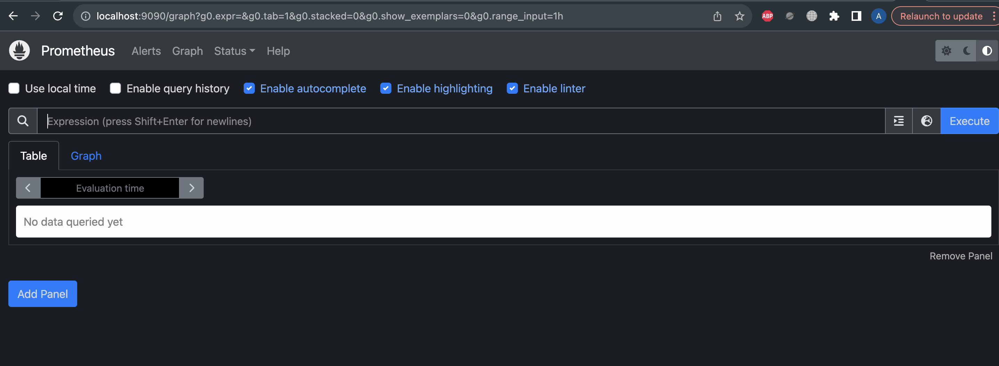
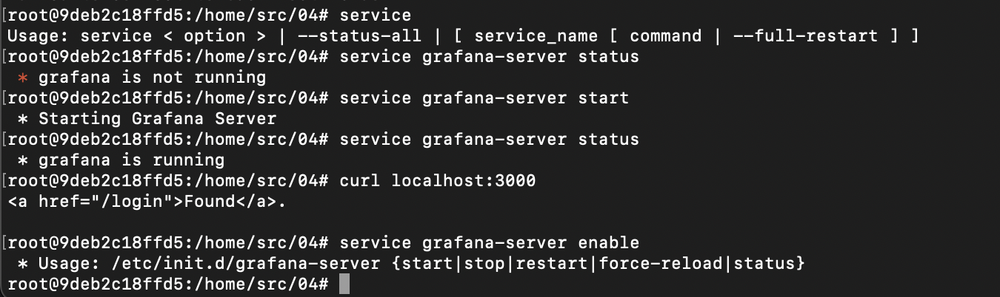
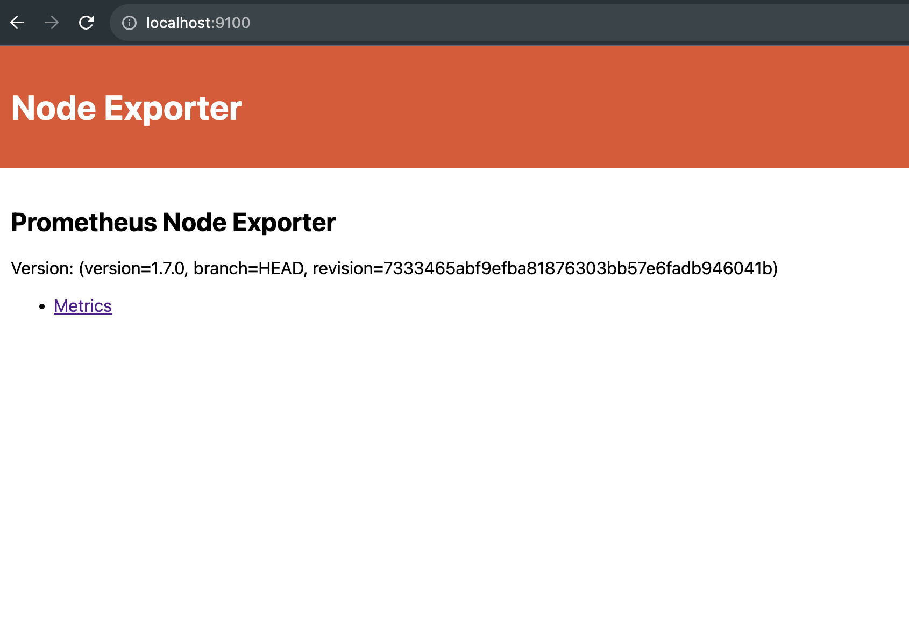
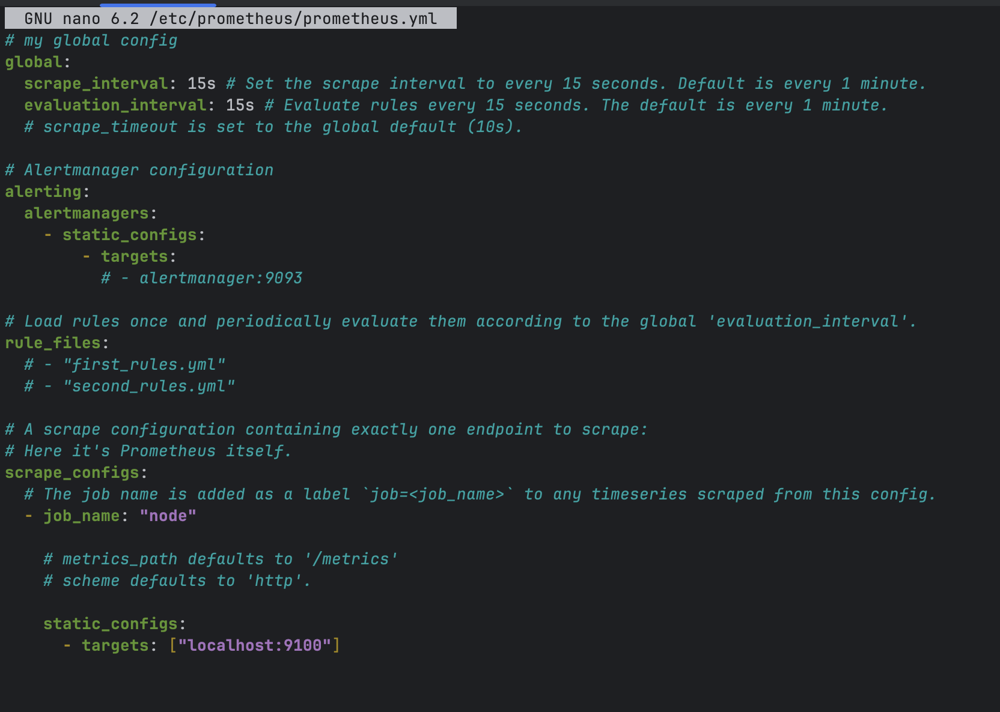
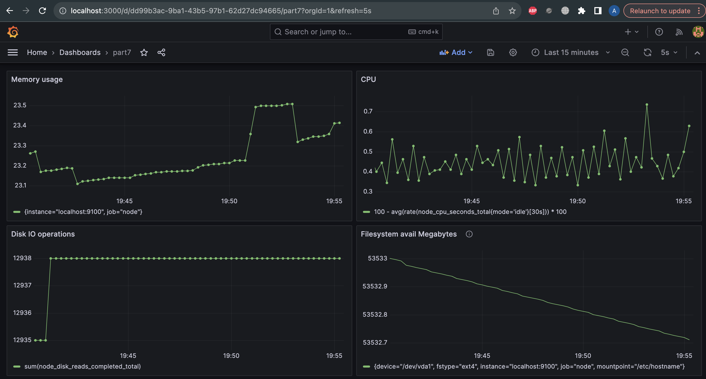
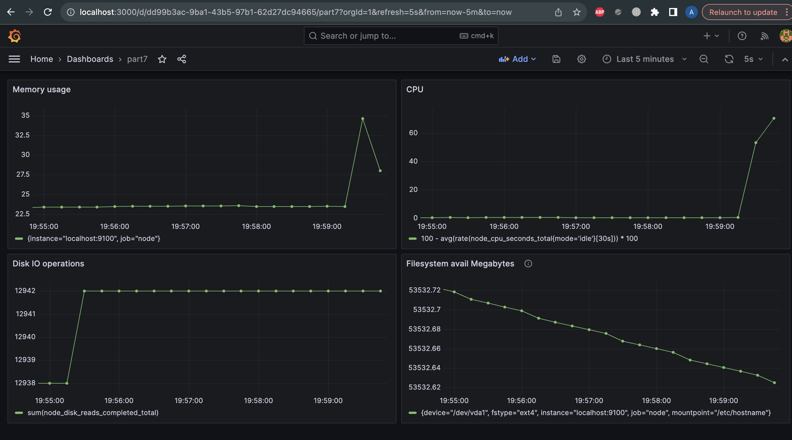
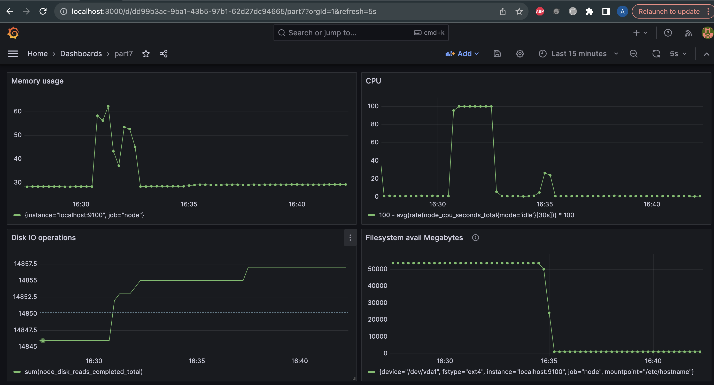

# Part 7. Prometheus and Grafana

## Prometheus

Устанавливаем Prometheus по [инструкции](https://www.cherryservers.com/blog/install-prometheus-ubuntu)

После этого получаем на локальной машине на порту 9090 вот такую картину:



## Grafana

Устанавливаем по [инструкции](https://grafana.com/grafana/download?edition=oss) Grafana OSS (это Open Source версия, бесплатная, и доступна в РФ без ВПН)

У меня не получилось воспользоваться утилитой systemctl в контейнере, 
поэтому пришлось пользоваться утилитой service, чтобы включить Графану



После этого переходим на нашей основной машине по адресу localhost:3000,
вводим логин и пароль "admin", по желанию устанавливаем новый пароль,
не короче 8 символов, как требует безопасность

Приветствуем Grafana на нашей машине!


## Node_exporter

Устанавливаем Node_exporter по [инструкции](https://prometheus.io/docs/guides/node-exporter/)



## Приступаем к работе

В итоге у нас должны быть установлены и запущены в фоновом режиме

Prometheus, Grafana, Node_exporter

Prometheus доступен на порту 9090, Node_exporter на порту 9100, Grafana на порту 3000

Каждый из них доступен0 также и на локальной машине,
благодаря тому, что мы создавали докер контейнер с замапленными портами

После установки нужно отредактировать файл prometheus.yml, 
который у нас находится по адресу /etc/prometheus/prometheus.yml.
Изменяем файл таким образом, чтобы Prometheus получал не свои метрики, 
а метрики от Node_Exporter



После этого перезапускаем службу Prometheus, и 


Для отображения требуемых по заданию метрик используем следующие запросы в PromQL:

1. Нагрузка процессора: ```100 - avg(rate(node_cpu_seconds_total{mode='idle'}[30s])) * 100```
2. Нагрузка оперативной памяти: ```100 - node_memory_MemFree_bytes / node_memory_MemTotal_bytes * 100```
3. Доступное место на файловой системе ```node_filesystem_avail_bytes{mountpoint='/etc/hostname'}/1024/1024```
  Информацию получаем в мегабайтах
4. Количество операций записи/чтения с жесткого диска: ```sum(node_disk_reads_completed_total)```

Получаем вот такой дашборд:



## stress

Давайте добавим нашей машине стресса!

```apt install stress```

Приведенная для примера команда ```stress -c 2 -i 1 -m 1 --vm-bytes 32M -t 10s```
недостаточно сильно нагружает систему. Чтобы увидеть какие-то серьезные изменения 
на графиках, увеличим показатели нагрузки

```stress -c 2 -i 1 -m 1 --vm-bytes 1000M -t 120s``` вот так



## Запускаем скрипт из части 2

```bash main.sh qwe ab.cd 1Mb```

Здесь лучше не устанавливать большие значения, близкие к 100 Мб,
так как процесс пройдет очень быстро и нагрузка на систему не успеет подняться,
чтобы увидеть изменения на дашборде

Скрипт был запущен в 16:34:30



