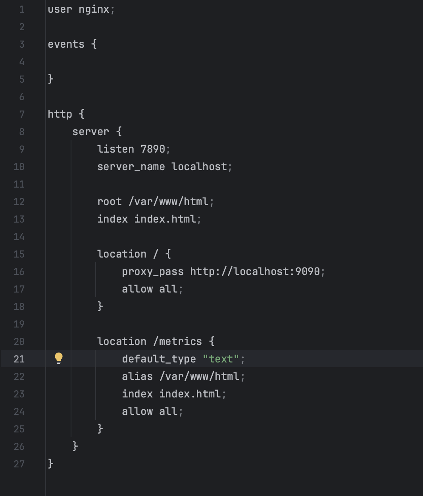
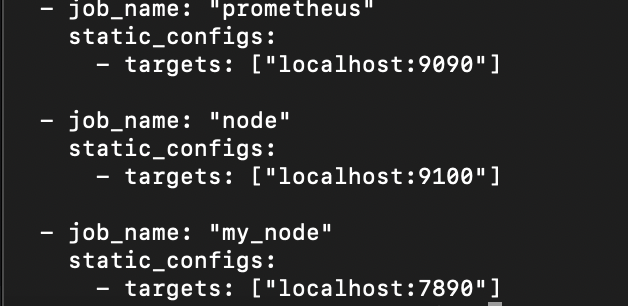
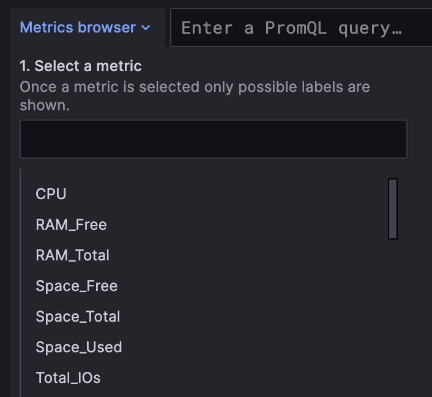
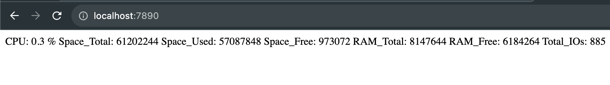

# Part 9: Bonus. Your own node_exporter

## Создаем свой конфиг nignx



Вот так выглядит конфиг Prometheus:



После этого при выборе метрик в Графане становятся доступны наши новые метрики,
прописанные в скрипте



После этого они начинают отображаться по адресу ```localhost:7890```

