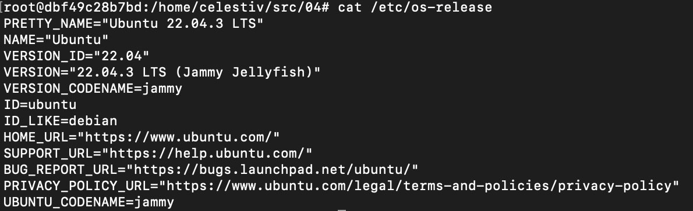
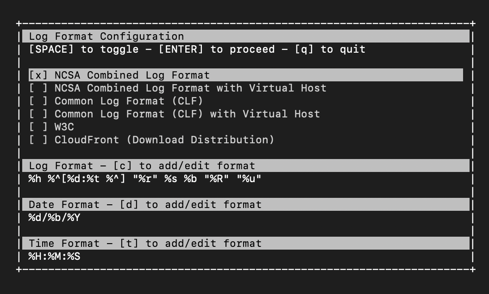
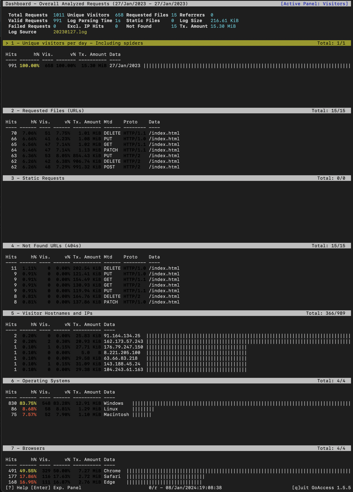
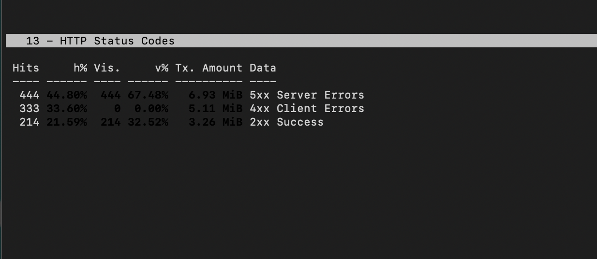
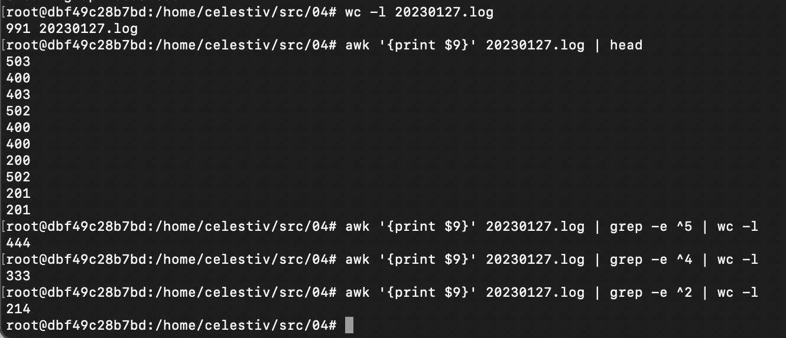
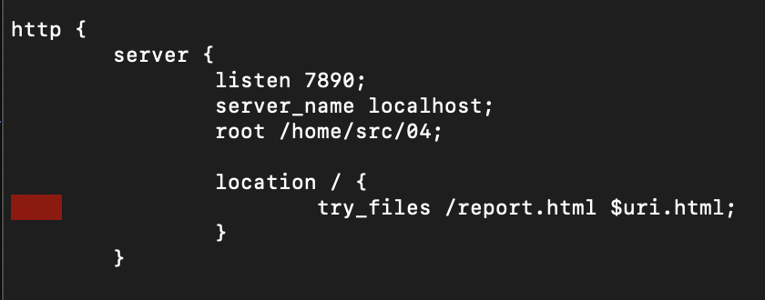
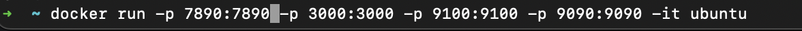
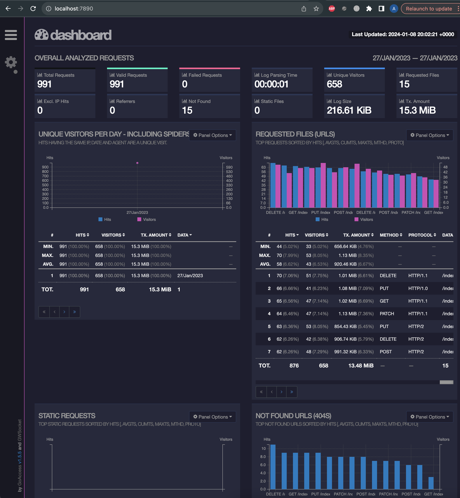

# part 6: GoAccess

проект выполнялся в докер контейнере на основе операционной системы Ubuntu:



[документация goaccess](https://goaccess.io/get-started)

Для того, чтобы воспользоваться утилитой goaccess, были проделаны следующие действия:

1. ```apt update```
2. ```apt -y upgrade```
3. ```apt install goaccess```

После этого вызываем goaccess и передаем ему файл с логами:

```goaccess 20230127.log```

В появившемся окне выбираем при помощи клавиши **Space** 
формат логов "NCSA Combined log format" и жмём **Enter**



Видим главное окно утилиты, на котором показана статистика, собранная из файла



Чтобы проверить, что мы не ошиблись, смотрим в поле "Hits", оно равно 991. 
Именно столько записей в нашем файле с логами

Перематываем вниз, смотрим раздел 13 "HTTP status codes"

Server errors: 444

Client errors: 333

Success: 214



Выходим из goaccess, нажимаем **q**

Проверяем вручную при помощи утилит **awk**, **grep**, **wc** 
сколько соответствующих статус кодов в нашем файле:



Все сходится!

Применяем знания из проекта SimpleDocker.
Устанавливаем nginx, меняем настройки в файле /etc/nginx/nginx.conf



Создаем файл с репортом, который позже будем отдавать при помощи nginx

```goaccess 20230127.log -o report.html```

```nginx -s reload```

```nginx -g "daemon off;"```

Забыл упомянуть, что докер контейнер изначально 
был запущен с замапленными портами ```docker run -p 7890:7890 ubuntu```



Примерно вот так 

Радуемся открытому дашборду на localhost:7890 на локальной машине!



Задание выполнено! Идем дальше
