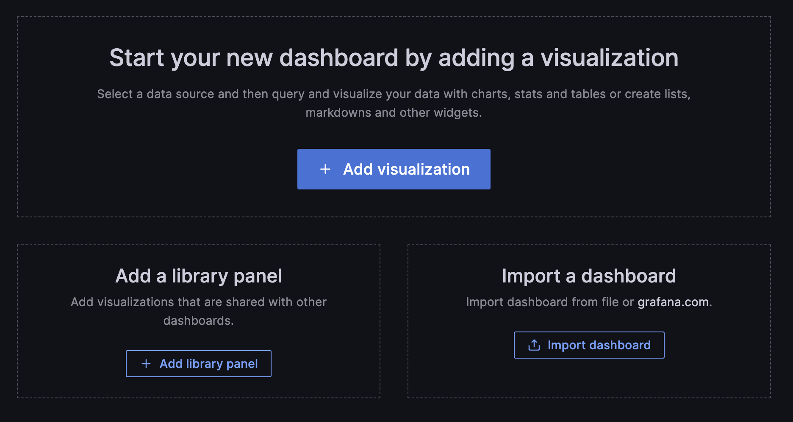
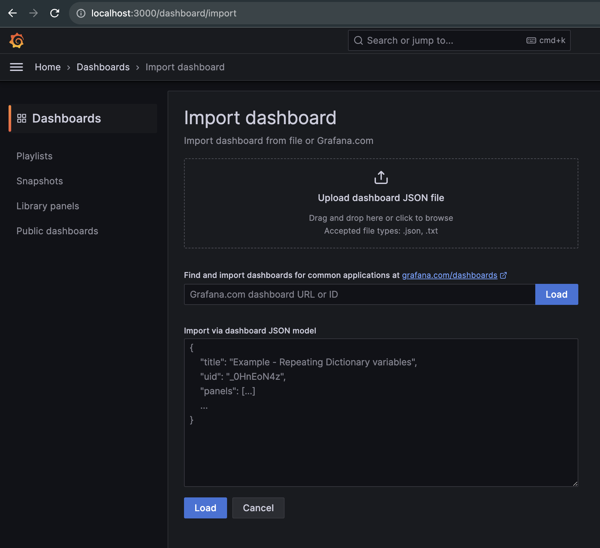
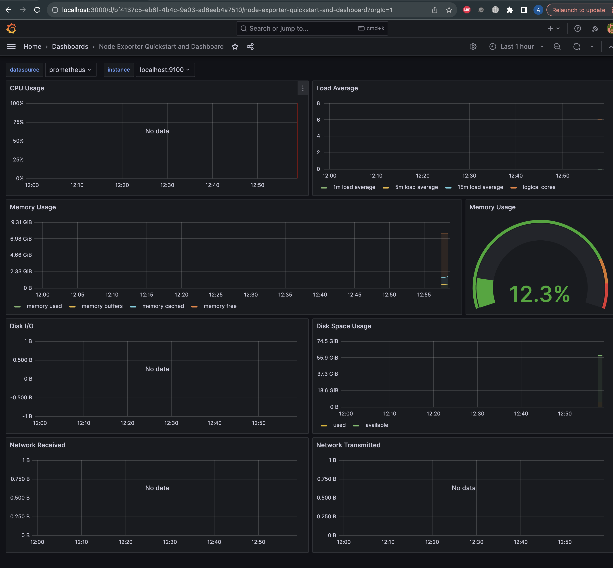
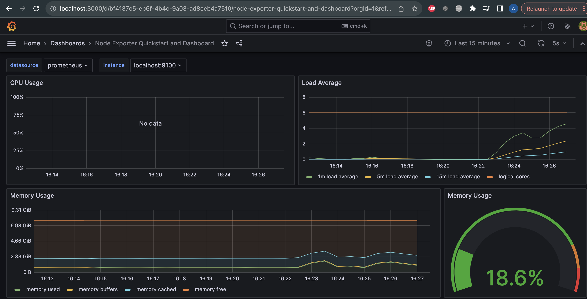
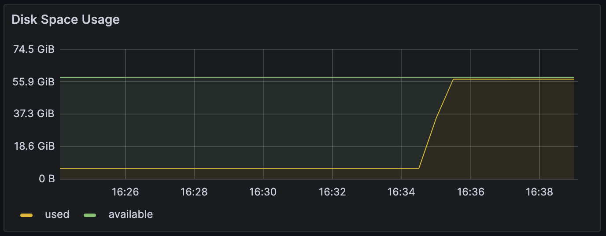

# Part 8: A ready-made dashboard

Можно импортировать конфиг двумя способами:

1. Скачать JSON файл и загрузить его в интерфейс Grafana
2. Просто скопировать номер конфига и вставить его в соответствующее поле
В нашем случае номер 13978





Вот так выглядит готовый дашборд:



## Stress

Запускаем команду стресс дважды с небольшим перерывом

```stress -c 2 -i 1 -m 1 --vm-bytes 1000M -t 120s```

```stress -c 2 -i 2 -m 1 --vm-bytes 1000M -t 120s```



За что отвечают флаги утилиты stress:

* ```-c``` - для нагрузки cpu. Использует функцию sqrt()
* ```-i``` - для нагрузки оперативной памяти. Использует функцию sync()
* ```-m``` - для нагрузки на жесткий диск. Использует функцию malloc()/free()
* ```---vm-bytes``` - объем виртуальной памяти, выделяемой для malloc()/free()
* ```-t``` - время работы программы в секундах

С учетом этой новой информации меняем параметры запуска утилиты stress,
чтобы увидеть более заметные изменения

```stress -c 6 -i 5 -m 4 --vm-bytes 1000M -t 120s```


## Запускаем скрипт из part 2

```bash main.sh ab cd.ef 10mb```

Получаем вот такую картину по тому насколько занят жесткий диск



