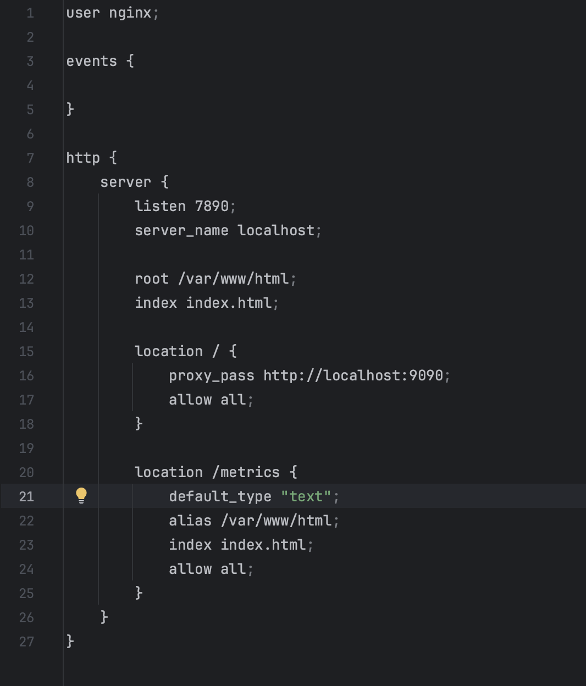
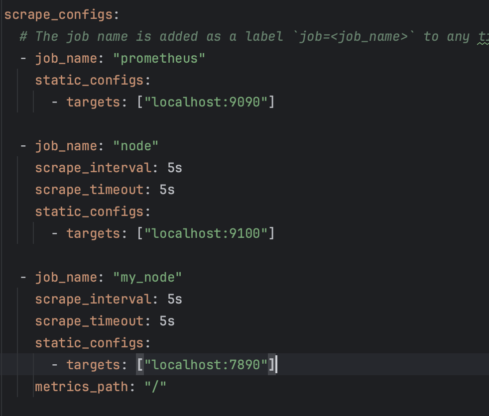
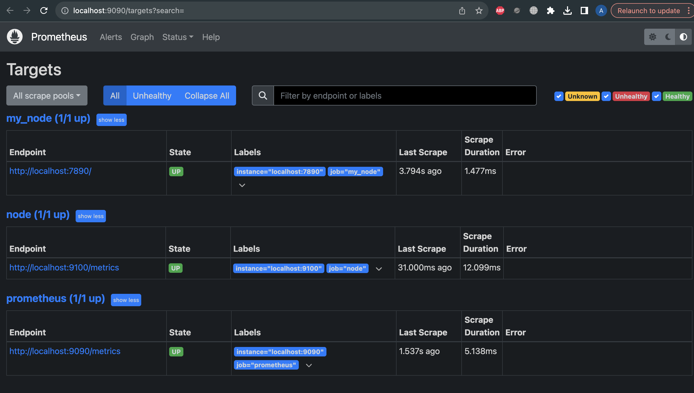
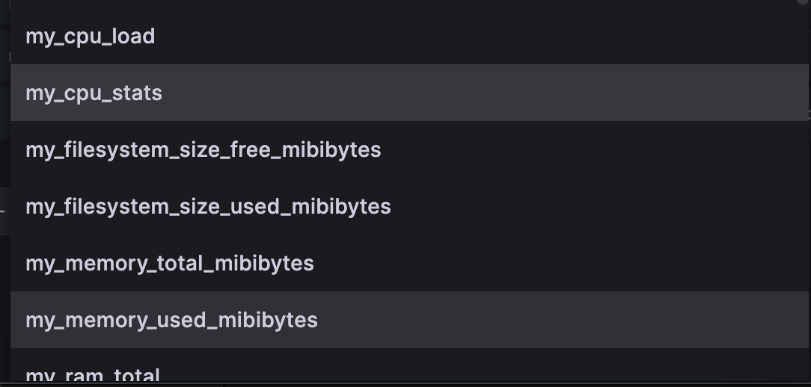
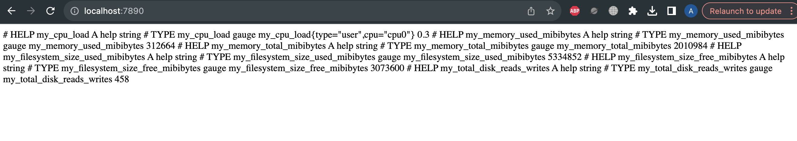
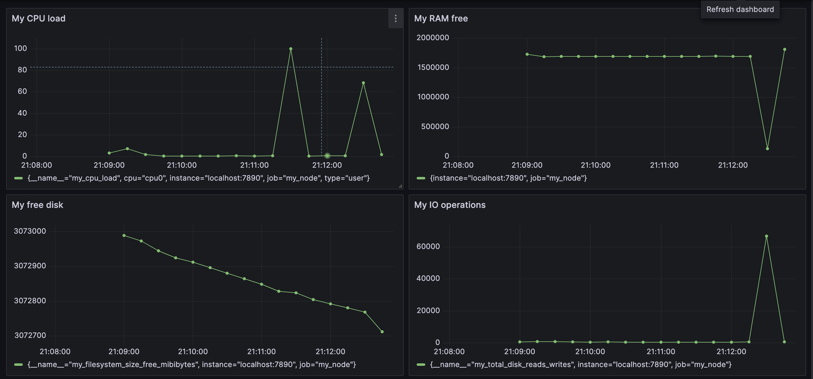
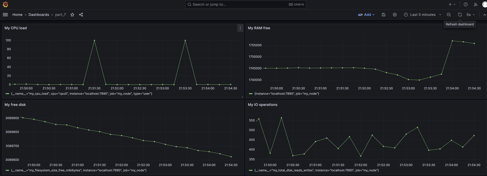

# Part 9: Bonus. Your own node_exporter

## Создаем свой конфиг nignx



Вот так выглядит конфиг Prometheus:



Вот такая картина в Prometheus targets:



После этого при выборе метрик в Графане становятся доступны наши новые метрики,
прописанные в скрипте



После этого они начинают отображаться по адресу ```localhost:7890```



## stress

Вот так выглядят графики после запуска утилиты stress:

```stress -c 6 -i 5 -m 4 --vm-bytes 1000M -t 120s```



## Запускаем скрипты из part 1, 2, 3


